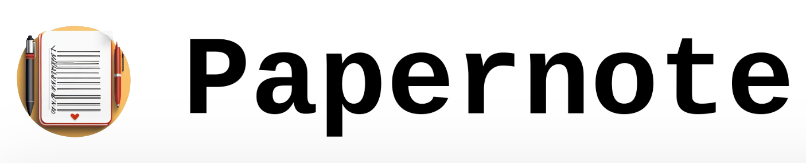

<center></center>

Self-hostable web app for markdown note-taking, written in Golang and utilizing HTMX. Notes are stored in plain markdown files. Multiple user support via SQLite.

This project was heavily inspired by another excellent note taking application, [Flatnotes](https://github.com/Dullage/flatnotes). It is very much a work in progress and lacks many features such as image support and the ability to rename notes.


## Notes Homepage

Landing page for browsing your notes. Hovering over a note title in the list shows a preview to the right. Quick actions (delete, fullscreen, edit) also appear next to the note title.


## Editor

No frills markdown editor. Write on the left, preview on the right. Thats it.


## Fullscreen View

Larger view of the rendered note.


## Development

Dependencies:
- [Golang](https://go.dev/)
- [air](https://github.com/cosmtrek/air) (for live reload in development)
- Optional: [Docker](https://www.docker.com/)

Run the air server and access the application at `localhost:8080`:

```
air
```

Test user and password:

- Username: `user`
- Password: `pass`

Makefile commands:

| Command        | Action                                 |
| -------------- | -------------------------------------- |
| `make build`   | Create Docker container                |
| `make run`     | Run temporary Docker container         |
| `make clean`   | Delete Docker container                |
| `make publish` | Publish Docker container to Docker Hub |
